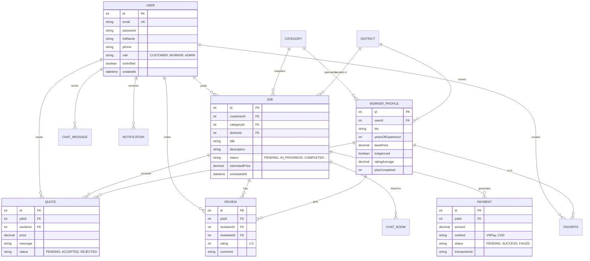
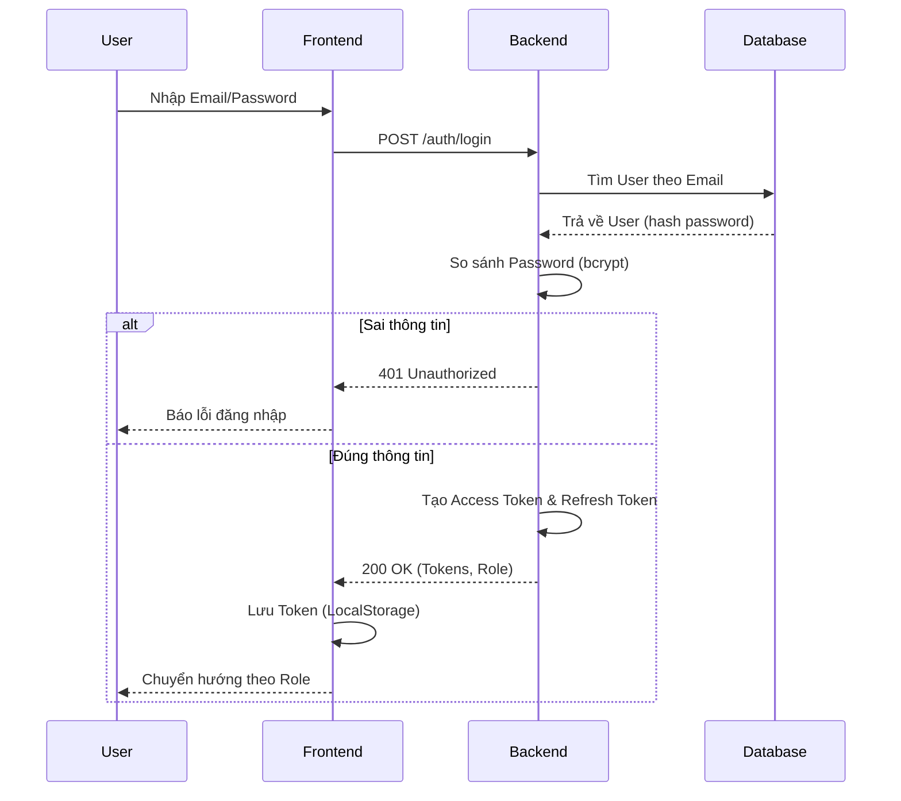
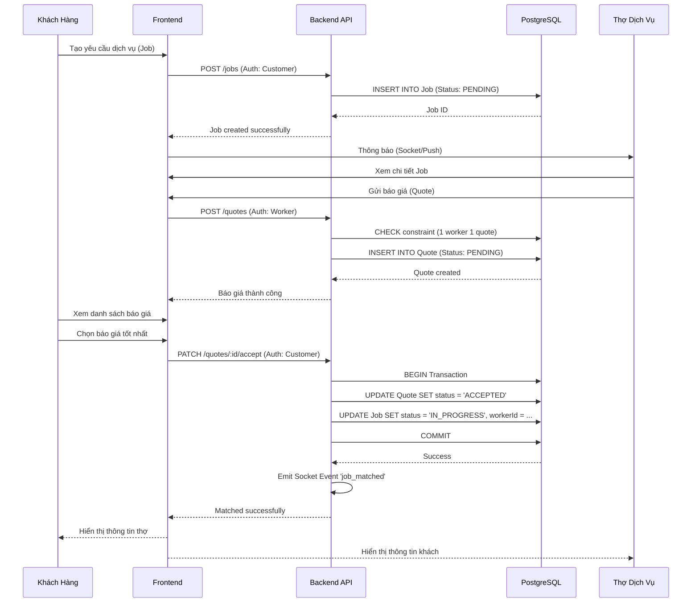
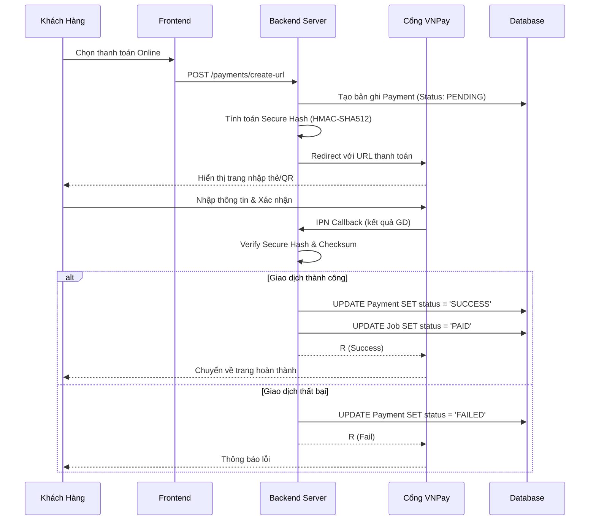
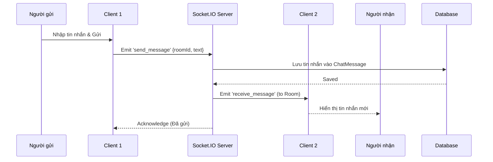

# Biểu Đồ Hệ Thống (Diagrams)

File này chứa mã nguồn Mermaid.js cho tất cả các biểu đồ sử dụng trong báo cáo đồ án. Bạn có thể sao chép mã bên dưới và dán vào [Mermaid Live Editor](https://mermaid.live) để xuất ra hình ảnh chất lượng cao (.png/.svg) chèn vào báo cáo.

---

## 1. Biểu Đồ Use Case (Use Case Diagrams)

### 1.1. Tổng quan hệ thống (General Overview)
Biểu đồ mô tả tổng quan các tác nhân và chức năng chính của hệ thống.

```mermaid
usecaseDiagram
    actor "Khách Hàng" as Customer
    actor "Thợ Dịch Vụ" as Worker
    actor "Quản Trị Viên" as Admin

    package "Nền Tảng Kết Nối Dịch Vụ Gia Đình" {
        usecase "Đăng ký / Đăng nhập" as UC_Auth
        usecase "Quản lý hồ sơ cá nhân" as UC_Profile
        usecase "Đăng yêu cầu dịch vụ (Job)" as UC_PostJob
        usecase "Tìm kiếm thợ dịch vụ" as UC_SearchWorker
        usecase "Gửi báo giá (Quote)" as UC_SendQuote
        usecase "Chấp nhận báo giá" as UC_AcceptQuote
        usecase "Thực hiện công việc" as UC_DoJob
        usecase "Đánh giá & Xếp hạng" as UC_Review
        usecase "Thanh toán online" as UC_Payment
        usecase "Chat thời gian thực" as UC_Chat
        usecase "Quản lý người dùng" as UC_ManageUsers
        usecase "Duyệt hồ sơ thợ" as UC_ApproveWorker
        usecase "Xem thống kê báo cáo" as UC_Stats
    }

    Customer --> UC_Auth
    Customer --> UC_Profile
    Customer --> UC_PostJob
    Customer --> UC_SearchWorker
    Customer --> UC_AcceptQuote
    Customer --> UC_Review
    Customer --> UC_Payment
    Customer --> UC_Chat

    Worker --> UC_Auth
    Worker --> UC_Profile
    Worker --> UC_SearchWorker
    Worker --> UC_SendQuote
    Worker --> UC_DoJob
    Worker --> UC_Review
    Worker --> UC_Chat

    Admin --> UC_Auth
    Admin --> UC_ManageUsers
    Admin --> UC_ApproveWorker
    Admin --> UC_Stats
```

### 1.2. Chi tiết vai trò Khách Hàng (Customer)

```mermaid
usecaseDiagram
    actor "Khách Hàng" as C

    package "Chức năng Khách Hàng" {
        usecase "Đăng ký tài khoản" as UC1
        usecase "Đăng nhập (JWT)" as UC2
        usecase "Tạo mới yêu cầu (Job)" as UC3
        usecase "Xem danh sách báo giá" as UC4
        usecase "Chọn thợ & Chấp nhận giá" as UC5
        usecase "Thanh toán qua VNPay" as UC6
        usecase "Gửi tin nhắn cho thợ" as UC7
        usecase "Viết đánh giá sau dịch vụ" as UC8
        usecase "Lưu thợ yêu thích" as UC9
    }

    C --> UC1
    C --> UC2
    C --> UC3
    C --> UC4
    C --> UC5
    C --> UC6
    C --> UC7
    C --> UC8
    C --> UC9
```

### 1.3. Chi tiết vai trò Thợ Dịch Vụ (Worker)

```mermaid
usecaseDiagram
    actor "Thợ Dịch Vụ" as W

    package "Chức năng Thợ Dịch Vụ" {
        usecase "Đăng ký tài khoản thợ" as UC1
        usecase "Cập nhật hồ sơ kỹ năng" as UC2
        usecase "Tìm việc phù hợp khu vực" as UC3
        usecase "Gửi báo giá cho Job" as UC4
        usecase "Cập nhật trạng thái công việc" as UC5
        usecase "Nhận tiền thanh toán" as UC6
        usecase "Chat với khách hàng" as UC7
        usecase "Xem lịch sử làm việc" as UC8
    }

    W --> UC1
    W --> UC2
    W --> UC3
    W --> UC4
    W --> UC5
    W --> UC6
    W --> UC7
    W --> UC8
```

---

## 2. Sơ Đồ Cơ Sở Dữ Liệu (ERD)

Sơ đồ quan hệ thực thể được sinh tự động dựa trên file `schema.prisma`.



---

## 3. Biểu Đồ Tuần Tự (Sequence Diagrams)

### 3.1. Luồng Đăng Nhập & Phân Quyền (Authentication Flow)



### 3.2. Luồng Đăng Việc & Chấp Nhận Thợ (Core Business Flow)



### 3.3. Luồng Thanh Toán VNPay (Payment Flow)



### 3.4. Luồng Chat Thời Gian Thực (Real-time Chat Flow)



---

## 4. Biểu Đồ Triển Khai (Deployment Diagram)

Mô tả kiến trúc vật lý khi triển khai hệ thống.

```mermaid
flowchart TD
    subgraph Client_Tier ["Lớp Client"]
        Browser[Trình duyệt Web]
        Mobile[Thiết bị di động - Tương lai]
    end

    subgraph Server_Tier ["Lớp Server (VPS/Cloud)"]
        Nginx[Nginx Reverse Proxy]
        FE_App[Frontend App (React/Vite)]
        BE_App[Backend API (NestJS/Node.js)]
        Socket[Socket.IO Service]
    end

    subgraph Data_Tier ["Lớp Dữ liệu"]
        Postgres[(PostgreSQL Database)]
        Redis[(Redis Cache - Tương lai)]
    end

    subgraph External ["Dịch vụ bên thứ 3"]
        VNPay[Cổng thanh toán VNPay]
        SMS[Twilio/Firebase SMS]
    end

    Browser -->|HTTPS| Nginx
    Nginx -->|Proxy Pass| FE_App
    Nginx -->|API Gateway| BE_App
    FE_App <-->|REST API / WebSocket| BE_App
    BE_App <-->|Query SQL| Postgres
    BE_App <-->|Pub/Sub| Socket
    BE_App -->|Payment Request| VNPay
    BE_App -->|OTP Request| SMS
```

---

## 5. Hướng Dẫn Sử Dụng Các Biểu Đồ

1.  Truy cập [Mermaid Live Editor](https://mermaid.live).
2.  Copy toàn bộ khối mã (bắt đầu bằng ```mermaid và kết thúc bằng ```) của biểu đồ bạn cần.
3.  Dán vào khung soạn thảo bên trái của trang web.
4.  Biểu đồ sẽ hiển thị ngay lập tức bên phải.
5.  Nhấn vào nút **Actions** > **Download PNG** (hoặc SVG) để tải ảnh về.
6.  Chèn ảnh vào file báo cáo Word/LaTeX tại vị trí tương ứng.

*Lưu ý: Đảm bảo font chữ trong biểu đồ đồng bộ với font chữ của báo cáo (thường là Times New Roman hoặc Arial) bằng cách chỉnh sửa trong phần cài đặt của Mermaid Live Editor nếu cần.*
